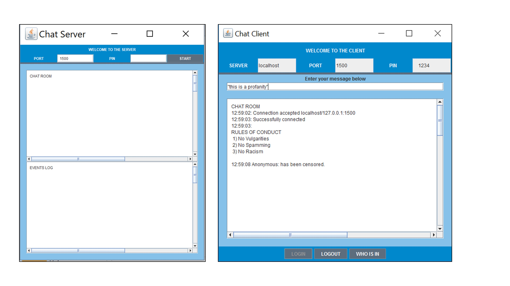

# Secure Chat Application

***Secure Chat Application*** is a Java program that simulates a chat server that enables secure communication within 2 or more parties over a network, such as over
a Local Area Network (LAN) or over the Internet. One of the computers acts as a chat server, and the other acts as a chat client.

The server and client are required to acknowledge each other’s presence through authentication and communicate securely through the use of 
encryption and decryption of messages. There is key agreement involved where the server and client each will have their own public-private key pair used  for the encryption / decryption of the AES  keys and messages. As for authentication, the 
server and the client will need to agree on a common port which was already in the original program, but now with the addition of a common 
secret pin (or password). The common secret pin forces the client to know the server’s given pin before being able to start talking to 
other clients. 

Encrypted messages that are sent and received will protect the content from being able to be modified or captured by third parties through 
man-in-the-middle attack. The idea of encrypting the messages is similar to the real-world example of Whatsapp having 
end-to-end encryption, but applied here as a more fundamental prototype to strengthen the security to the best of our abilities under the 
time constraints and project requirements. 

## Preview

## Usage

1. Clone this repository into any directory. 

2. Enter the "secure-chat-application" directory by typing `cd secure-chat-application`.

3. Run the client and server programs.

## Acknowledgements

- **Darren Chua** | [@chydarren](https://github.com/chydarren)
- **Daryl Lim** | [@PlatyPew](https://github.com/PlatyPew)
- **Joshua Soh** | [@PototoPatata](https://github.com/PototoPatata)
- **Chng Wei Cheng**

## Credits

This program was developed as an assignment for the Singapore Polytechnic, ST2504 Applied Cryptography module. I have uploaded the source files publicly for reference and personal usage only. Please refrain from [plagiarising](https://www.sp.edu.sg/sp/student-services/ssc-overview/student-handbook/intellectual-property-copyright-and-plagiarism) or passing it off as your own work. 

Chua Han Yong Darren © 2017. Code released under the GNU Affero General Public License v3.0.

